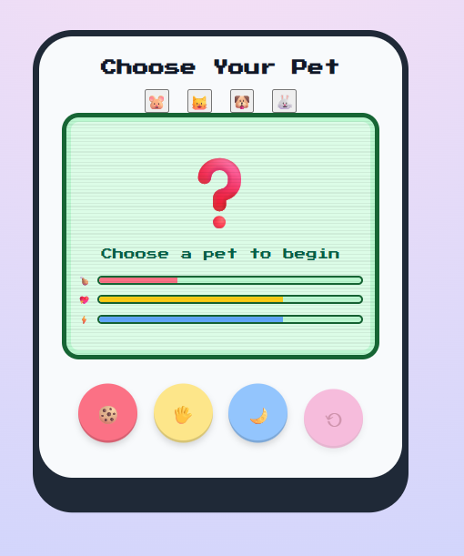
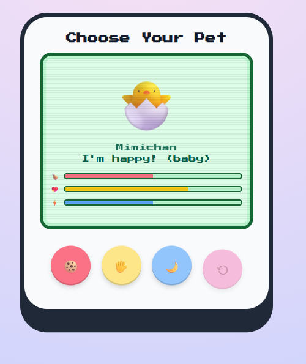
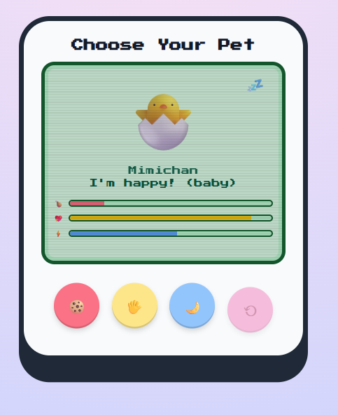

# 🐣 Virtual Pet Simulator

A Tamagotchi-style virtual pet web application built using vanilla HTML, CSS, and JavaScript.

## ✨ Features
- Choose one pet from multiple options
- Time-based hunger, energy, and happiness system
- Pet evolution: Baby → Teen → Adult
- Sleep mode with animation and faster energy recovery
- Visual stat bars and attention cues
- Sound feedback for interactions
- Persistent state using localStorage
- Reset and restart lifecycle

## 🛠️ Tech Stack
- HTML
- CSS
- JavaScript (Vanilla)

## 📸 Screenshots
(Add screenshots here)

## 🚀 How to Run
1. Clone the repository
2. Open `index.html` in your browser

## 💡 What I Learned
- DOM manipulation and event handling
- State management in frontend apps
- UI/UX polish and feedback design
- Using localStorage for persistence
- Game-like logic using timers

## 📸 Screenshots

### Pet Selection

### Main Screen

### Sleeping Pet

